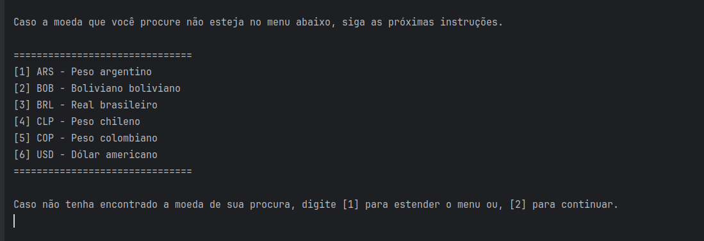
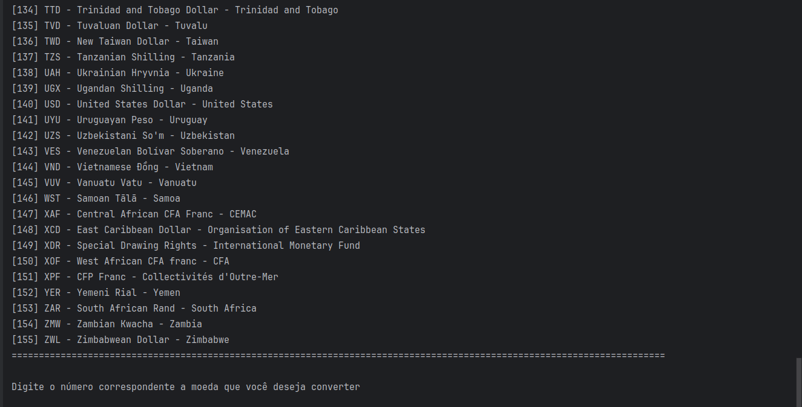
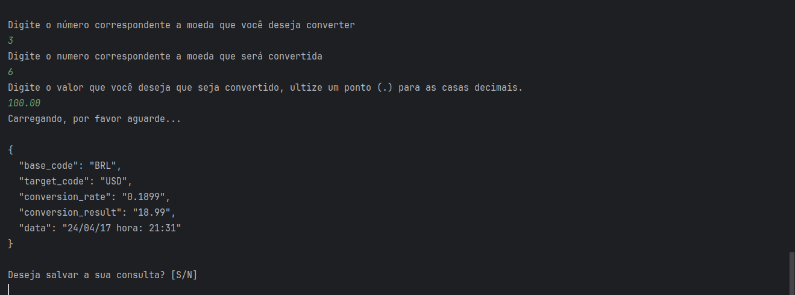
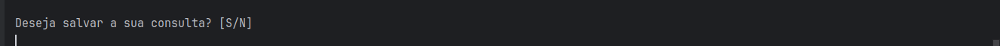
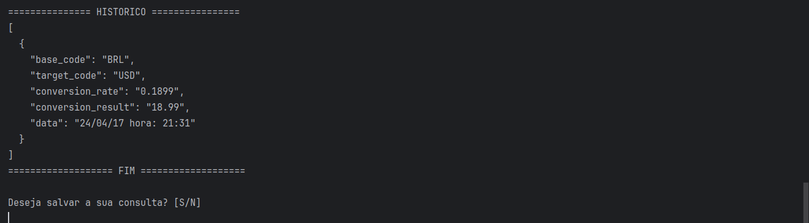

# Conversor de Moedas

O Conversor de Moedas é um programa que converte moedas em tempo real de 155 países. Você pode salvar suas consultas em arquivos e também manter um histórico de consultas diretamente do seu terminal.

## Indice

1. Menu;
2. Extendendo o menu;
3. Ultilizando o conversor;
4. Salvando o arquivo;
5. Gerando e salvando historico.
6. Encerrando o programa

### Menu

O Conversor de Moedas é um programa que converte moedas em tempo real de 155 países. Você pode salvar suas consultas
em arquivos e também manter um histórico de consultas diretamente do seu terminal.

Aqui estão algumas moedas de alguns países espalhados pelo globo. Para fazer uma conversão, digite o número que
antecede as moedas de sua escolha, escolhendo primeiramente a moeda base e em seguida a moeda na qual você gostaria de
converter e, após isso, digite o valor a ser convertido. (Observação: digite ponto [.] para identificar casas decímais.)

### Extendendo o menu
Ao digitar 1, será exibido o menu completo de todas as moedas disponiveis no programa e, digitando dois, você será 
movido para próxima etapa do programa, que é a conversão.

### Ultilizando o conversor
Digite o número que antecede as moedas de sua escolha, escolhendo primeiramente a moeda base e em seguida a moeda na
qual você gostaria de converter e, após isso, digite o valor a ser convertido. 
(Observação: digite ponto [.] para identificar casas decímais.)

### Salvando o arquivo;
Após ter feito uma conversão, você terá opção de salvar a sua pesquisa. Caso deseje, pressione "S" - que corresponde a "sim" -, caso não seja de seu desejo, pressione "N" - que corresponde a "não" -
Sua pesquisa ficara salva no caminho : src/resources/savedFile.

### Gerando e salvando historico

Você terá a opção de ter acesso ao seu histórico das suas buscas ao pressionar "H" - que 
significa "histórico de consulta" -, o programa exibirá uma mensagem para que você possa salvar seu histórico em um 
documento em formato .json
Sua pesquisa ficara salva no caminho : src/resources/history.

Ao final do programa, será exibido uma mensagem que lhe perguntará se você deseja encerrar a consulta ou iniciar
uma nova busca, digite "N" caso já tenha finalizado sua consulta ou "S" para comecar uma nova.

### Desenvolvedor

Alexandre Dinis

